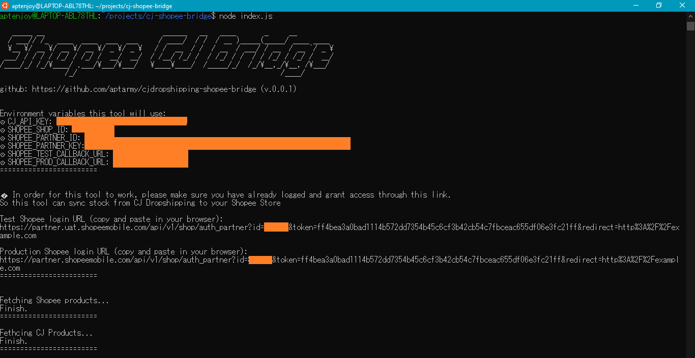
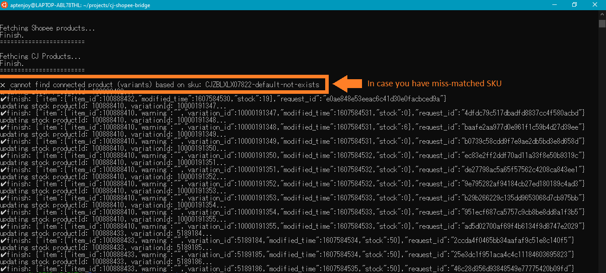

# Welcome to Shopee-CJ Stock Sync Tool
This tool is created to sync stock between Shopee and CJ Dropshipping. Normally stock changes from suppliers in CJ won't lead to the update in the stock of connected Shopee store. This would lead to stock problems and affects the score of Shopee store. That's why I create this tool.

This tool is open source, as I want to make it as transparent as possible.

## How to use this tool to sync Shopee store stock with CJ Dropshipping stock
This tool is not intended to be used as an app with GUI, everything would be done on command-line interface, so if you are a programmer and developer, then this is a plus. Command-line interface would look familiar to you.

Before you can use this tool, You need to have your own `partnerId`, `partnerKey`, `storeId` from Shopee.

Here are simple steps to let this tool to work

### Prepare Shopee key and CJ key
1)  Signup on open.shopee.com to get your own `partnerId` and `partnerKey`. Please follow this link to registrar your developer account open.shopee.com
2) Open your store in Shopee.
3) Setup your callback URL in open.shopee.com
3) put your `SHOPEE_SHOP_ID`, `SHOPEE_PARTNER_ID`, `SHOPEE_PARTNER_KEY`, `SHOPEE_TEST_CALLBACK_URL`, and `SHOPEE_PROD_CALLBACK_URL` in your machine environment. Or you can create `.env` file and put those variables in the newly created `.env` file.
4) Generate your CJ Dropshipping API Key and put the key `CJ_API_KEY` in your machine environment

### Prepare your machine to run this tool
1) install `Node.js` and make sure `node` and `npm` command is available in your terminal (checking your `PATH`).
2) `cd` to this project and run `npm install`
3) to sync the product in your Shopee store and CJ, simply run this command `node index.js` or `npm run start`
4) If you have never grant your dev account access to your store, you will need to login to Shopee through provided URL (Auth URL using Shopee rules) to grant your dev account an access to your store.
5) For subsequent `npm run start`, you don't need to login again. Stock syncing for both `item` and `variants` will be done automatically.

### Connect your Shopee products to CJ inventory
In this step just follow CJ Dropshipping tutorial, and make sure SKU from both platforms matches.

## There are somethings you should take a note
1) This tool will look at SKU in your Shopee products, so if you have already connected CJ products with your Shopee products, then make sure SKU of the item from 2 platforms is the same, including SKU of variants (like colors, size, etc.)
2) If you type  in not-match SKU, then this tool cannot match your product on Shopee to your CJ connected product. This will result in cross sign in console like this figure below.

